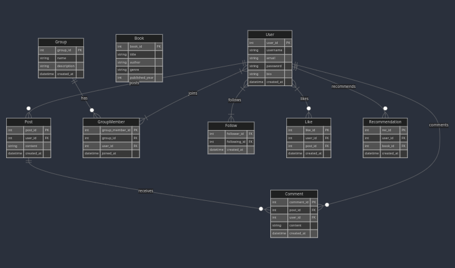

# BookHive: Online Book Club

Welcome to **BookHive**, an open platform designed to connect and engage book enthusiasts worldwide. Whether you're an avid reader, an aspiring author, or someone who simply appreciates the written word, BookHive offers a space to share your passion for books.

## Features

- **Community Engagement**: Connect with fellow book lovers globally. Engage in discussions, share recommendations, and participate in reading challenges and book clubs.
- **Book Reviews and Ratings**: Share your thoughts on your favorite books. Write reviews, rate books, and read others' reviews to discover new literary gems.
- **Author Spotlights**: Learn about authors and their works through exclusive interviews and spotlights. Interact with your favorite authors and discover new ones.
- **Personalized Recommendations**: Receive book suggestions based on your reading preferences, favorite genres, and followed authors.
- **Reading Challenges**: Participate in reading challenges to set goals, track progress, and explore different genres and authors.
- **Book Clubs**: Join or create book clubs focused on specific genres, themes, or authors. Engage in meaningful discussions and share insights.
- **Events and Workshops**: Stay updated with literary events, workshops, and author signings happening near you or online.

## Getting Started

To get started with BookHive:

1. **Sign Up**: Create an account by providing your basic details or sign up using your social media accounts.
2. **Explore**: Browse the platform to discover the community, book reviews, author spotlights, and book clubs that interest you.
3. **Engage**: Share your own book reviews, ratings, and recommendations. Participate in discussions, join reading challenges, and connect with fellow book lovers.
4. **Discover**: Use personalized recommendations to find new books that align with your interests.
5. **Stay Connected**: Keep an eye on upcoming events, workshops, and book signings. Attend virtual or physical events to meet authors and connect with fellow enthusiasts.

## Documentation

The Software Requirements Specification (SRS) document for BookHive is available in the repository. It provides detailed information about the platform's requirements, features, and system architecture. See [BookHive_SRS.md](document/markup/BookHive_SRS.md) for details.

### Entity Relationship Diagram


## How to Run the Project

1. Clone the repository
2. Install dependencies:
   ```bash
   pnpm install
   ```
3. Start the development server:
   ```bash
   pnpm dev
   ```
4. Build the project for production:
   ```bash
   pnpm build
   ```
5. Start the production server:
   ```bash
   pnpm start
   ```

## Contributing

We welcome contributions to BookHive! Please read our [Contributing Guidelines](document/markup/CONTRBUTING.md) to get started.

## Landing Page Layout


## Project Structure

We are using an atomic folder structure for our application:

```
src/
├── components/
│   ├── atoms/
│   │   ├── button/
│   │   │   ├── Button.js
│   │   │   ├── button.css
│   │   │   └── index.js
│   │   ├── input/
│   │   │   ├── Input.js
│   │   │   ├── input.css
│   │   │   └── index.js
│   │   └── icon/
│   │       ├── Icon.js
│   │       ├── icon.css
│   │       └── index.js
│   ├── molecules/
│   │   ├── loginForm/
│   │   │   ├── LoginForm.js
│   │   │   ├── loginForm.css
│   │   │   └── index.js
│   │   └── navbar/
│   │       ├── Navbar.js
│   │       ├── navbar.css
│   │       └── index.js
│   └── organisms/
│       ├── userProfile/
│       │   ├── UserProfile.js
│       │   ├── userProfile.css
│       │   └── index.js
│       └── productCard/
│           ├── ProductCard.js
│           ├── productCard.css
│           └── index.js
├── templates/
│   ├── dashboard/
│   │   ├── Dashboard.js
│   │   ├── dashboard.css
│   │   └── index.js
│   └── landingPage/
│       ├── LandingPage.js
│       ├── landingPage.css
│       └── index.js
└── pages/
    ├── home/
    │   ├── Home.js
    │   ├── home.css
    │   └── index.js
    └── about/
        ├── About.js
        ├── about.css
        └── index.js'''
